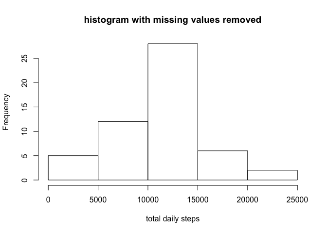
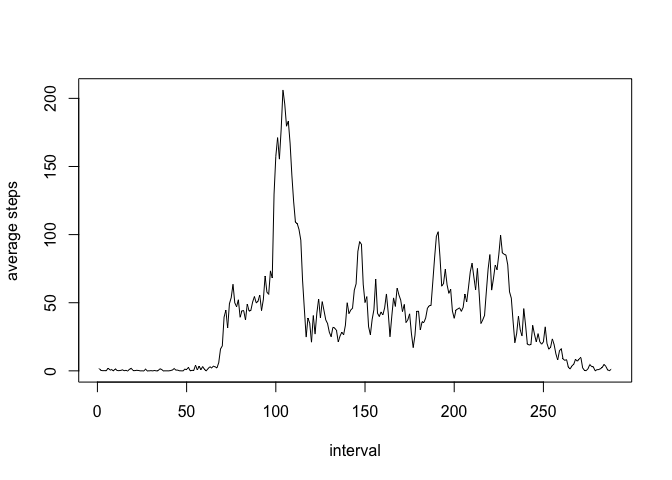

# Reproducible Research: Assignment 1 


## Loading and preprocessing the data

```r
setwd("/Users/utamhank/Desktop/DataScience/Reproducible Research/P1")
df <- read.csv("activity.csv")
df1 <- df[!is.na(df$steps),]
df2 <- df1[!is.na(df1$date),]
totalsteps <- tapply(df2$steps, factor(df2$date), sum)
```

## Histogram of total number of steps taken each day

```r
hist(totalsteps, main ="histogram with missing values removed", xlab ="total daily steps")
```

 

```r
dev.copy(png, file="plot1.png", width = 480, height = 480)
```

```
## quartz_off_screen 
##                 3
```

```r
dev.off(3)
```

```
## quartz_off_screen 
##                 2
```

## What is mean total number of steps taken per day?

```r
m1 <- mean(totalsteps)
print(m1)
```

```
## [1] 10766.19
```

## what is the median number of steps taken per day

```r
median(totalsteps)
```

```
## [1] 10765
```

## What is the average daily activity pattern?


```r
df3 <- df2[!is.na(df2$interval),]
avgintervalsteps <- tapply(df3$steps, factor(df3$interval), mean)
plot(avgintervalsteps, xlab="interval", ylab="average steps", type="l")
```

 

```r
dev.copy(png, file="plot2.png", width = 480, height = 480)
```

```
## quartz_off_screen 
##                 3
```

```r
dev.off(3)
```

```
## quartz_off_screen 
##                 2
```

## Imputing missing values
## total count for NA for steps

```r
## total count for NA for steps
count <- nrow(df) - nrow(df1)
print(count)
```

```
## [1] 2304
```
## total count for NA for date

```r
count <- nrow(df2) - nrow(df1)
print(count)
```

```
## [1] 0
```
## total count for NA for interval

```r
count <- nrow(df3) - nrow(df2)
print(count)
```

```
## [1] 0
```

# create a new data frame where all rows with NA are replaced by the average steps for that interval

```r
dfnew <- df
dfnew$steps[is.na(dfnew$steps)] <- avgintervalsteps[as.character(dfnew$interval[is.na(dfnew$steps)])]
```

# Total steps per day for the new data frame

```r
tsnew <- tapply(dfnew$steps, factor(dfnew$date), sum)
```
## Histogram of total number of steps taken each day with imputed values

```r
hist(tsnew, main ="histogram with missing values replaced ", xlab ="total daily steps")
```

 

```r
dev.copy(png, file="plot3.png", width = 480, height = 480)
```

```
## quartz_off_screen 
##                 3
```

```r
dev.off(3)
```

```
## quartz_off_screen 
##                 2
```

## What is mean total number of steps taken per day with the new data set?

```r
m1 <- mean(tsnew)
print(m1)
```

```
## [1] 10766.19
```

## what is the median number of steps taken per day with the new data set

```r
median(tsnew)
```

```
## [1] 10766.19
```

## Are there differences in activity patterns between weekdays and weekends?

```r
# convert time to weekdays

dfnew$datenew <- strptime(dfnew[,"date"], "%Y-%m-%d")
dfnew$day <- weekdays(dfnew$datenew)
dfnew$day <- factor(dfnew$day)
# collapse levels into 2
levels(dfnew$day) <- c("weekday","weekday","weekend","weekend", "weekday", "weekday", "weekday")

avgstepsnew  <- tapply(dfnew$steps, factor(dfnew$interval), mean)

library(lattice)
xyplot(steps ~ interval | day, data = dfnew, layout = c(1,2) , type = "l" )
```

 

```r
x <- with(dfnew, tapply(steps, list(interval, day), mean))

dev.copy(png, file="plot4.png", width = 480, height = 480)
```

```
## quartz_off_screen 
##                 3
```

```r
dev.off(3)
```

```
## quartz_off_screen 
##                 2
```
