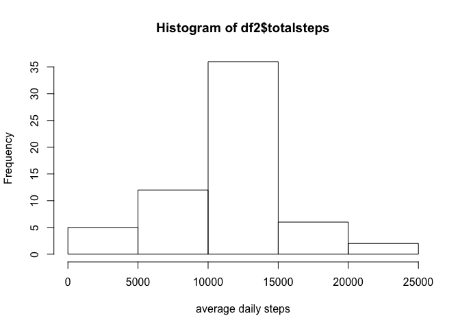

# Reproducible Research: Peer Assessment 1


## Loading and preprocessing the data

```r
setwd("/Users/utamhank/Desktop/DataScience/Reproducible Research/P1")
df <- read.csv("activity.csv")
df1 <- df[!is.na(df$steps),]
totalsteps <- tapply(df1$steps, df1$date, sum)
totalsteps1 <- totalsteps[!is.na(totalsteps)]
```

## Histogram of total number of steps taken each day

```r
hist(totalsteps1, main ="histogram with missing values removed", xlab ="total daily steps")
```

 

## What is mean total number of steps taken per day?

```r
m1 <- mean(totalsteps1)
print(m1)
```

```
## [1] 10766.19
```

## what is the median number of steps taken per day

```r
median(totalsteps1)
```

```
## [1] 10765
```

## What is the average daily activity pattern?


```r
avgintervalsteps <- tapply(df1$steps, df1$interval, mean)
plot(avgintervalsteps, xlab="interval", ylab="average steps", type="l")
```

 

## Imputing missing values


```r
df2  <- as.data.frame(totalsteps)
count <- nrow(df2[is.na(df2$totalsteps),])
print(count)
```

```
## [1] 8
```

```r
df2$totalsteps[is.na(df2$totalsteps)] <- rep(c(m1), count)
hist(df2$totalsteps, mail="histogram with imputed values", xlab ="average daily steps")
```

```
## Warning in plot.window(xlim, ylim, "", ...): "mail" is not a graphical
## parameter
```

```
## Warning in title(main = main, sub = sub, xlab = xlab, ylab = ylab, ...):
## "mail" is not a graphical parameter
```

```
## Warning in axis(1, ...): "mail" is not a graphical parameter
```

```
## Warning in axis(2, ...): "mail" is not a graphical parameter
```

 

## Are there differences in activity patterns between weekdays and weekends?
